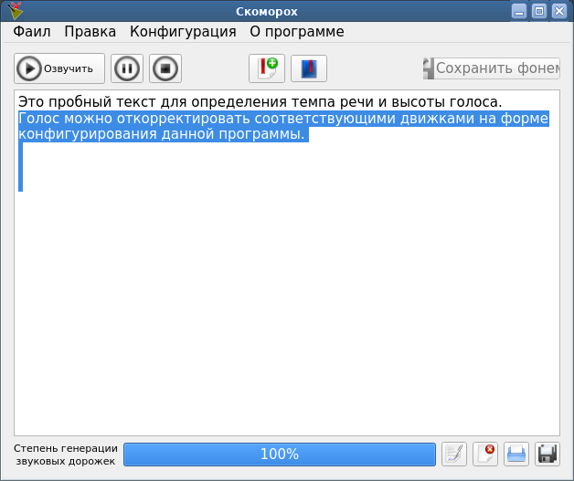

# Skomoroh

Программа предназначена для озвучки русских текстов, с использованием tts-движков с русскими голосами.

В данной программе предусмотренна возможность работы с движками `eSpeak`, `RHVoice`, `ru_tts` и с любым другим движком, который может быть вызван из коммандной стороки и результат преобразования может быть представлена в виде `wav`-файла.

Т.к. предполагается вывод в `WAV` формате, при помощи `sox` ему, как и в `Festival`, можно регулировать темп речи, тон голоса, придавать эхо и делать разные изменения голоса.

Для функционирования этой программы требуются следующие пакеты:

1. установлены библиотеки `QT` 4.5  и выше
2. должен быть установлен движок `RHVoice`, `ru_tts`, `eSpeak` или любой другой движок, который может функционировать через коммандную строку.
3. должен быть установлен `sox`, `xsltproc` и `lynx`
4. Для успешного функционирования утилиты преобразования форматов файлов в текстовые: `antiword`, shell-утилита `antiodt`, файлом настройки `FB2_2_txt.xsl` для `xsltproc`.

